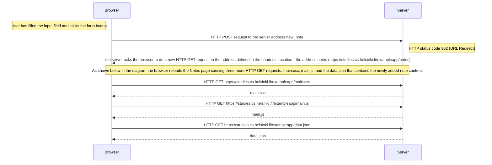

```mermaid
sequenceDiagram
Note left of Browser: User has filled the input field and clicks the form button
Browser->>Server: HTTP POST request to the server address new_note
Note right of Server: HTTP status code 302 (URL Redirect)
Server-->>Browser: the server asks the browser to do a new HTTP GET request to the address defined in the header's Location - the address notes (https://studies.cs.helsinki.fi/exampleapp/notes)
Note over Browser,Server: As shown below in the diagram the browser reloads the Notes page causing three more HTTP GET requests: main.css, main.js, and the data.json that contains the newly added note content.
Browser->>Server: HTTP GET https://studies.cs.helsinki.fi/exampleapp/main.css
Server-->>Browser: main.css
Browser->>Server: HTTP GET https://studies.cs.helsinki.fi/exampleapp/main.js
Server-->>Browser: main.js
Browser->>Server: HTTP GET https://studies.cs.helsinki.fi/exampleapp/data.json
Server-->>Browser: data.json
```
