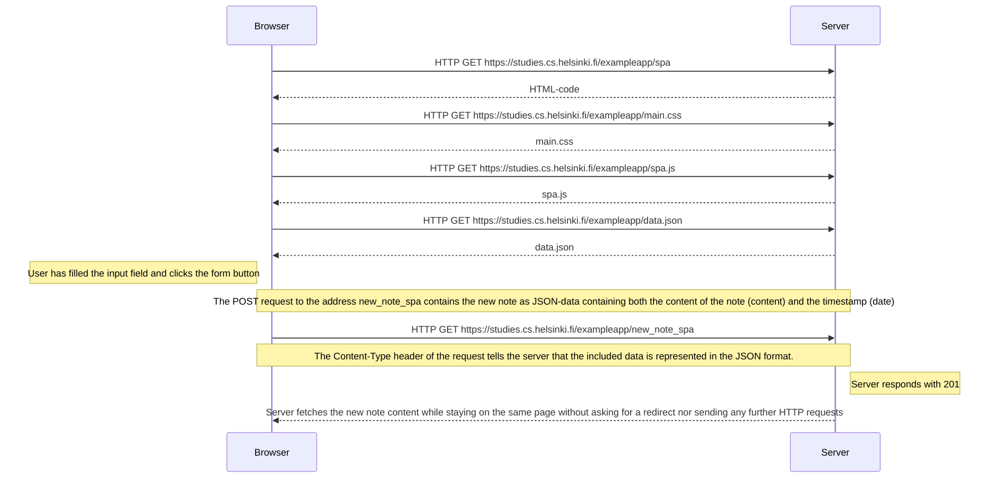

```mermaid
sequenceDiagram
Browser->>Server: HTTP GET https://studies.cs.helsinki.fi/exampleapp/spa
Server-->>Browser: HTML-code
Browser->>Server: HTTP GET https://studies.cs.helsinki.fi/exampleapp/main.css
Server-->>Browser: main.css
Browser->>Server: HTTP GET https://studies.cs.helsinki.fi/exampleapp/spa.js
Server-->>Browser: spa.js
Browser->>Server: HTTP GET https://studies.cs.helsinki.fi/exampleapp/data.json
Server-->>Browser: data.json
Note left of Browser: User has filled the input field and clicks the form button
Note over Browser,Server: The POST request to the address new_note_spa contains the new note as JSON-data containing both the content of the note (content) and the timestamp (date)
Browser->>Server: HTTP GET https://studies.cs.helsinki.fi/exampleapp/new_note_spa
Note over Browser,Server: The Content-Type header of the request tells the server that the included data is represented in the JSON format.
Note right of Server: Server responds with 201
Server-->>Browser: Server fetches the new note content while staying on the same page without asking for a redirect nor sending any further HTTP requests
```
